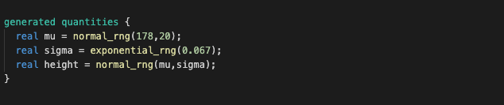
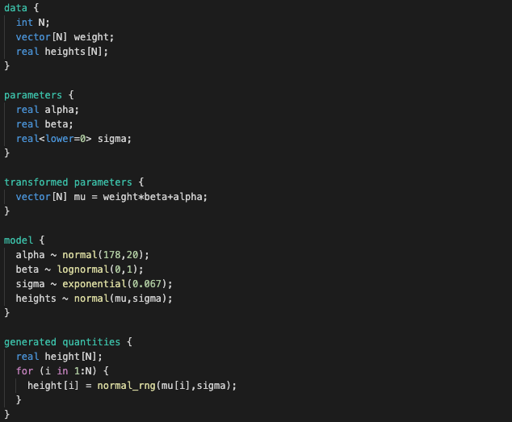
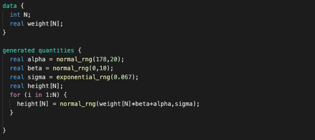
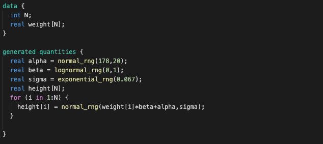

# Lab 4 - Linear models


## Excercise 1 - modelling height of !Kung people


Tasks for whole exercise are specified in the labolatory notebook. Here you can find code for stan models:

```height_1_fit.stan```


<hr>

```height_1_ppc.stan```


<hr>

```height_2_fit.stan```


<hr>

```height_2a_ppc.stan```


<hr>

```height_2b_ppc.stan```

  